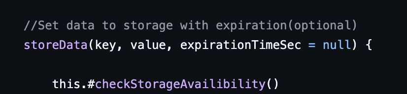
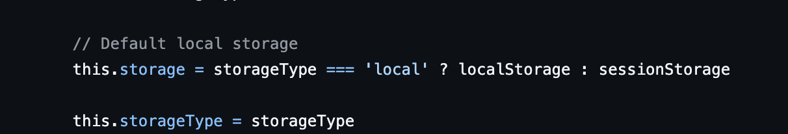
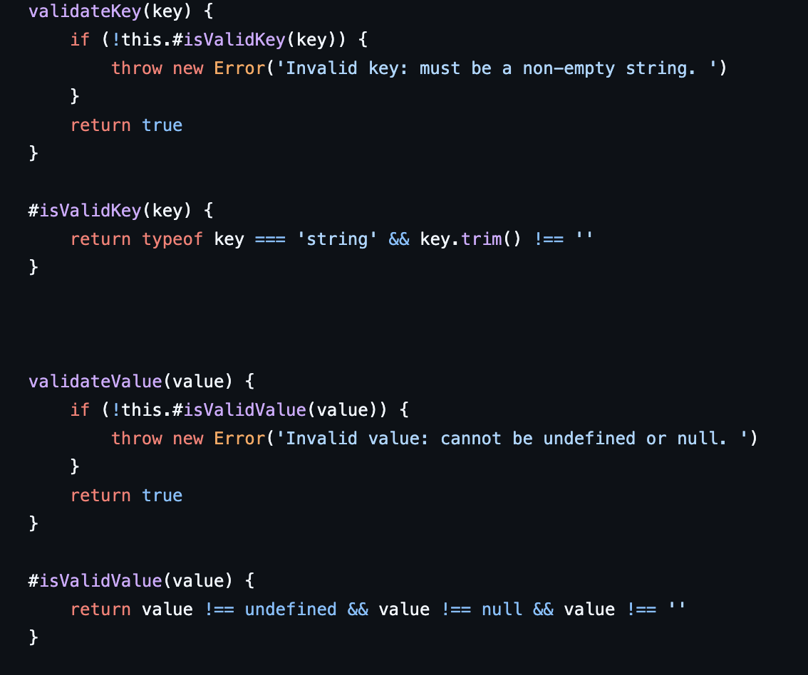
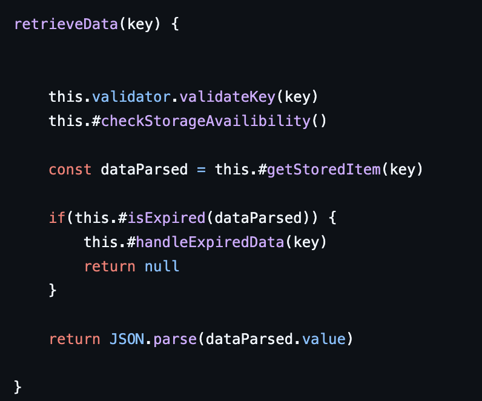
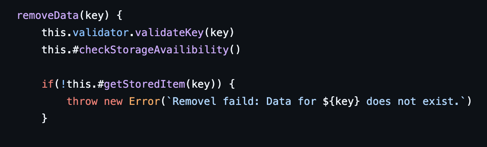
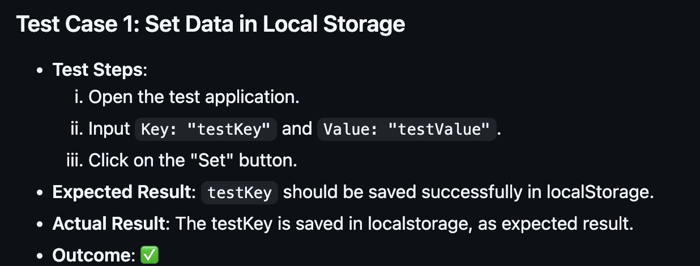

## Kapitel 2
I kapitlet insåg jag vikten av att ge variabler, metoder och klasser meningsfulla namn för att förbättra kodens läsbarhet. Tydliga namn gör det enklare att förstå koden, vilket minskar behovet av kommentarer. Jag lärde mig att undvika kryptiska förkortningar, som exempelvis "ttl", och ersätta dem med mer beskrivande namn som "expirationTimeSec". Balansen mellan tydlighet och läsbarhet är dock utmanande, och namn som "expirationTimeInSeconds" kan bli för långa om de används på flera ställen.

## Kapitel 3

Att göra funktioner korta och precisa har varit en stor utmaning för mig, då många av mina funktioner var stora och tog många argument. Dessa funktioner gjorde flera saker och hade därmed flera anledningar till förändring, vilket går emot Single Responsibility Principle (SRP) som boken betonar. Jag har försökt dela upp funktionerna för att ge dem mer fokuserade ansvarsområden, vilket är ett sätt att förbättra läsbarheten och underhållbarheten enligt boken. Jag har också förbättrat namnet på min funktion från setData till storeData, vilket gör den mer beskrivande och i linje med bokens rekommendation om tydliga funktionsnamn. Att hålla antalet argument på tre eller färre har varit svårt för mig, men boken föreslår att det är en bra riktlinje för att hålla funktionerna hanterbara. Jag har inte lyckats minska argumenten under tre, men jag förstår vikten av att försöka hitta sätt att gruppera eller organisera argumenten bättre för att förenkla funktionen.

## Kapitel 4
Enligt boken bör kommentarer användas sparsamt och endast för att förklara varför något görs på ett visst sätt. Jag har försökt minimera användningen av kommentarer i min kod. Där jag har använt kommentarer är på två ställen:

Dessa kommentarer förklarar inte själva kodens funktion, utan snarare dess avsikt eller val av metod.

## Kapitel 5
Bokens kapitel om formattering fick mig att reflektera över hur kodens struktur påverkar läsbarheten. Jag har därför försökt placera funktioner som är relaterade till varandra direkt efter varandra i min kod. Genom att gruppera dem logiskt blir det enklare att följa flödet och förstå hur de hänger ihop, vilket minskar risken för missförstånd. Det hjälper även andra utvecklare att snabbt få en överblick och navigera i koden utan att behöva hoppa fram och tillbaka. Målet är att skapa en naturlig och sammanhängande struktur där funktioner presenteras i en ordning som gör koden mer intuitiv att läsa och underhålla.

Här är ett exempel där jag satt de närliggande funktionen direkt efter funktionen som använder sig utav den. 

## Kapitel 6
När jag byggde StorageWrapper-modulen insåg jag att jag faktiskt använde principerna från kapitel 6 om att kapsla in data och beteende i objekt. Genom att skapa ett strukturerat dataobjekt när jag sparar information, istället för att bara använda rådata, blev hanteringen både enklare och mer flexibel. Att använda privata metoder och en separat Validator-klass gjorde också att koden blev renare och lättare att förstå. Det har hjälpt mig att hålla saker separata och tydliga, vilket i slutändan har minskat komplexiteten i koden.

I min retrieveData()-metod har jag kapslat in både data och beteende genom att använda privata metoder för att kontrollera om lagrad data har gått ut och hantera detta automatiskt.

## Kapitel 7

I min odul har jag försökt att implementera en robust felhantering för att säkerställa att oväntade fel hanteras utan att krascha applikationen. Enligt bokens rekommendationer validerar jag  indata tidigt i funktion. I metoder som storeData() och removeData() använder jag exempelvis validator-klassen för att kontrollera nycklar och värden innan de sparas eller tas bort, vilket följer principen om Fail Fast. Detta gör koden mer förutsägbar och lättare att felsöka eftersom alla fel fångas upp direkt när de inträffar, snarare än att låta dem bubbla upp senare.

## Kapitel 8
Efter att ha läst kapitel 8 insåg jag att jag inte fullt ut har implementerat de principer som rekommenderas för att hantera gränssnitt mot externa system. Även om min-modul abstraherar localStorage och sessionStorage till viss del, är jag fortfarande starkt beroende av dessa direkt i koden. Till exempel använder jag direkt localStorage- och sessionStorage-API i metoder som storeData() och retrieveData(). Om jag skulle behöva byta till en annan lagringslösning skulle det kräva betydande förändringar i hela klassen.

## Kapitel 9
Efter att ha läst kapitel 9 om enhetstester insåg jag att jag försökt följa bokens rekommendationer om att hålla testerna enkla och isolerade, men jag har funnit det utmanande att skriva tester tidigt i utvecklingsprocessen. Jag har inte implementerat automatiserade tester än, vilket gör att mina manuella tester har blivit en fördröjning. Trots att jag försökt skriva tester som täcker specifika funktionaliteter har det varit svårt att isolera alla externa faktorer, särskilt när jag jobbar med localStorage, vilket gör testerna mer komplexa än jag hade förväntat mig. En förbättring skulle vara att integrera automatiserade tester från början för att göra processen mer effektiv och för att snabbt kunna upptäcka buggar.

## Kapitel 10
I Kapitel 10, "Classes", betonas vikten av att hålla klasser små och fokuserade på ett enda ansvar. I min kod har jag inte riktigt följt den här principen fullt ut, då jag har samlat all funktionalitet i en enda klass. Jag har försökt att bryta ut valideringen, men de flesta av funktionerna, är fortfarande samlade inom samma klass. Detta gör att klassen blir relativt stor och lite komplex, vilket gör det svårare att förstå och underhålla. En förbättring skulle vara att dela upp klassen i mindre delar för att bättre följa det som boken rekommenderar om att hålla klasser små och fokuserade på ett enda ansvar. Eftersom min modul inte är särskilt komplex ansåg jag att det inte var helt nödvändigt att dela upp den på det sättet, men jag kan ha missbedömt det.

## Kapitel 11
Eftersom min modul är relativt enkel har jag inte behövt tänka på skalbarhet på samma sätt som i större system, men jag har försökt hålla komponenterna åtskilda för att göra det lättare att modifiera i framtiden. Jag har till exempel hållit valideringen separat från huvudlogiken, vilket gör det enklare att lägga till eller ändra funktionalitet utan att påverka den övergripande strukturen.