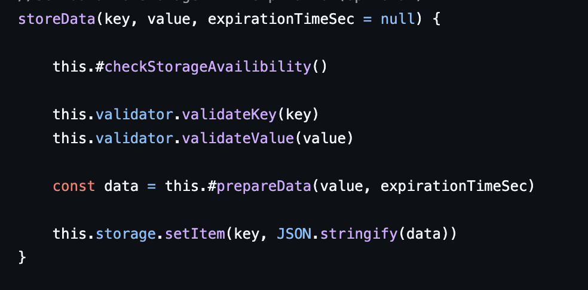

## Kapitel 2
I kapitlet insåg jag vikten av att ge variabler, metoder och klasser meningsfulla namn för att förbättra kodens läsbarhet. Tydliga namn gör det enklare att förstå koden, vilket minskar behovet av kommentarer. Jag lärde mig att undvika kryptiska förkortningar, som exempelvis "ttl", och ersätta dem med mer beskrivande namn som "expirationTimeSec". Balansen mellan tydlighet och läsbarhet är dock utmanande, och namn som "expirationTimeInSeconds" kan bli för långa om de används på flera ställen.

## Kapitel 3

Att göra funktioner korta och precisa har varit en stor utmaning för mig, då många av mina funktioner var stora och tog många argument. Dessa funktioner gjorde flera saker och hade därmed flera anledningar till förändring, vilket går emot Single Responsibility Principle (SRP) som boken betonar. Jag har försökt dela upp funktionerna för att ge dem mer fokuserade ansvarsområden, vilket är ett sätt att förbättra läsbarheten och underhållbarheten enligt boken. Jag har också förbättrat namnet på min funktion från setData till storeData, vilket gör den mer beskrivande och i linje med bokens rekommendation om tydliga funktionsnamn. Att hålla antalet argument på tre eller färre har varit svårt för mig, men boken föreslår att det är en bra riktlinje för att hålla funktionerna hanterbara. Jag har inte lyckats minska argumenten under tre, men jag förstår vikten av att försöka hitta sätt att gruppera eller organisera argumenten bättre för att förenkla funktionen.

